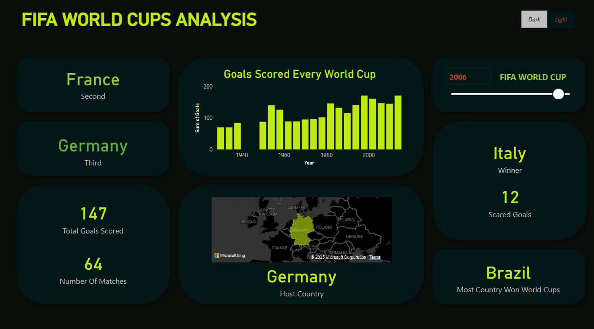
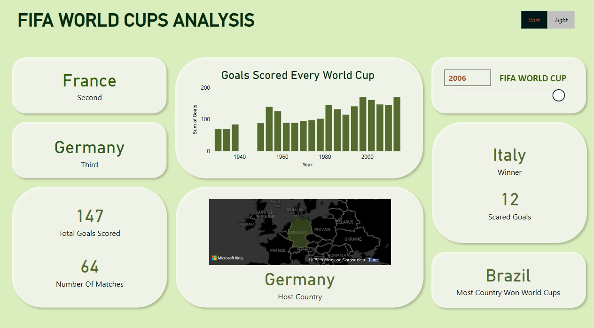
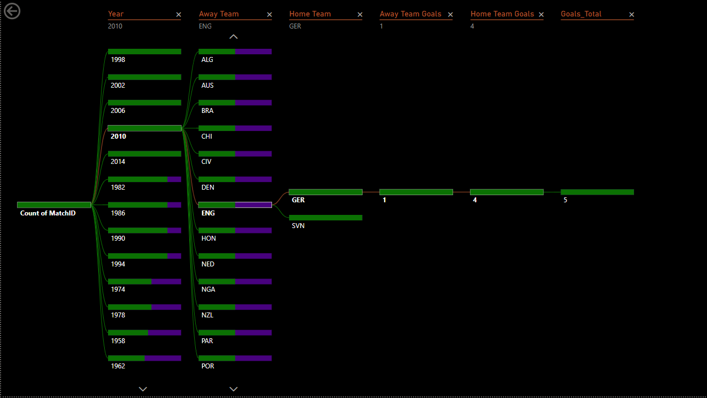

# FIFA World Cups Analysis using Power BI

## Overview

This project utilizes Power BI to analyze and visualize data related to the FIFA World Cups. The analysis covers various statistics such as goals scored, matches played, and the performance of different countries. The project provides insightful dashboards that help users understand trends and patterns in the FIFA World Cup data.

## Contents

1. [Introduction](#introduction)
2. [Dashboard: FIFA World Cups Analysis](#dashboard-fifa-world-cups-analysis)
3. [Dashboard: Soccer Match Data (2010)](#dashboard-soccer-match-data-2010)
4. [Conclusion](#conclusion)

## Introduction

The FIFA World Cup is the most prestigious football tournament in the world, attracting millions of fans and generating extensive data. This project aims to analyze this data and present it in a visually appealing and easily understandable format using Power BI.

## Dashboard: FIFA World Cups Analysis

### Dark Theme

### Light Theme

The "FIFA World Cups Analysis" dashboard provides a comprehensive overview of various statistics related to the FIFA World Cup. Key elements include:

- **Title**: FIFA WORLD CUPS ANALYSIS
- **Toggle Switch**: For "Dark" and "Light" modes
- **Country Sections**: France ("Second"), Germany ("Third"), Italy ("Winner"), and Brazil ("Most Country Won World Cups")
- **Statistics**: "147 Total Goals Scored" and "64 Number Of Matches"
- **Bar Chart**: "Goals Scored Every World Cup" from 1940 to 2000
- **Map**: Highlighting Germany as the "Host Country"
- **Slider**: For "2006 FIFA WORLD CUP"

## Dashboard: Soccer Match Data (2010)

This dashboard visualizes data from a soccer match in the year 2010, specifically focusing on a match where the away team is England (ENG) and the home team is Germany (GER). Key elements include:

- **Year**: 2010
- **Away Team**: England (ENG)
- **Home Team**: Germany (GER)
- **Away Team Goals**: 1
- **Home Team Goals**: 4
- **Total Goals**: 5

## Conclusion

This project demonstrates the power of Power BI in analyzing and visualizing complex datasets. The dashboards provide valuable insights into the FIFA World Cup data, helping users understand trends and patterns. Feel free to explore the dashboards and customize them based on your requirements.

## How to Use

1. Clone the repository: `git clone https://github.com/yourusername/fifa-world-cups-analysis.git`
2. Open the Power BI file: `fifa_world_cups_analysis.pbix`
3. Explore the dashboards and interact with the visualizations.

## Contact

For any questions or suggestions, please contact [yourname@domain.com](mailto:yourname@domain.com).
